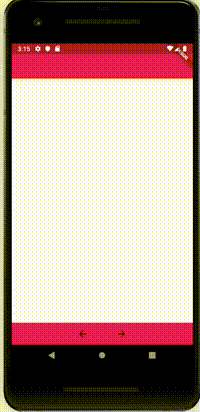
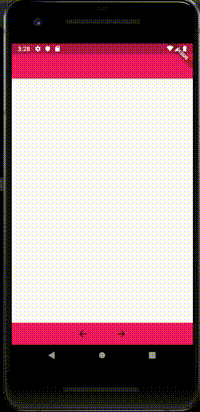

# Expandable Bottombar

An expandable bottom bar.

Allows to have a custom app bottom bar. Which allow to have a hidden content that can be displayed by dragging up.

## Screenshots

<br/>


## Getting Started

#### Params
* **barButtons** allows to pass a widget (typically a row) that contains the buttons
  which will handle the app bar functionality.
* **child** widget that contains the hidden content.
* **scaffoldChild** widget that contains the hidden content, but this hidden content
  is wrapped inside a Scaffold widget. Only child or scaffoldChild is allow no
  both at same time.
* **opacity** the oppacity of hidden content.
* **stopOnDrag** if true when the user stops dragging the hidden content will stay visible
  if false the hidden content will be expanded/narrowed to the top or the end of the screen and then disappear.
* **autoHide** hides the app bottom bar while the user is dragging the hidden content.

```import 'package:expandable_bottom_bar_example/second.dart';
import 'package:flutter/material.dart';

import 'package:flutter/services.dart';
import 'package:expandable_bottom_bar/expandable_bottom_bar.dart';

void main() => runApp(MyApp());

class MyApp extends StatelessWidget {
  @override
  Widget build(BuildContext context) {
    return MaterialApp(
      title: 'Flutter Demo',
      theme: ThemeData(
        primarySwatch: Colors.blue,
      ),
      routes: <String, WidgetBuilder>{
        '/': (BuildContext context) => MyHomePage(title: 'Demo'),
        '/second': (BuildContext context) => SecondPage(),
      },
    );
  }
}

class MyHomePage extends StatefulWidget {
  MyHomePage({Key key, this.title}) : super(key: key);

  final String title;

  @override
  _MyHomePageState createState() => _MyHomePageState();
}

class _MyHomePageState extends State<MyHomePage> {

  @override
  Widget build(BuildContext context) {
    return Scaffold(
      appBar: AppBar(
        brightness: Brightness.dark,
        backgroundColor: Colors.pink,
      ),
      body: Container(
        color: Colors.white24,
      ),
      bottomNavigationBar: ExpandableBottomBar(
        autoHide: true,
        stopOnDrag: false,
        child: SomeImage(),
        color: Colors.green,
        barButtons: Container(
          color: Colors.pink,
          child: Row(
            mainAxisAlignment: MainAxisAlignment.center,
            children: <Widget>[
              FlatButton(
                onPressed: () {
                  print('onPressed <-');
                },
                child: Icon(Icons.arrow_back),
              ),
              FlatButton(
                child: Icon(Icons.arrow_forward),
                onPressed: () {
                  print('onPressed ->');
                },
              )
            ],
          ),
        ),
      ),
    );
  }
}

class SomeImage extends StatelessWidget {
  const SomeImage({Key key}) : super(key: key);

  @override
  Widget build(BuildContext context) {
    return Container(
      color: Colors.yellow[400],
      child: Column(
        children: <Widget>[
          Container(
            constraints: BoxConstraints(maxHeight: 200),
            child: Image.network(
                'https://www.mascotarios.org/wp-content/gallery/sanbernardo/sanbernardo9.jpg'),
          ),
          Container(
            child: Text('Main content', style: TextStyle(fontSize: 40)),
          ),
          RaisedButton(
            child: Text('Press'),
            onPressed: () {
              print('done');
            },
          )
        ],
      ),
    );
  }
}
```
